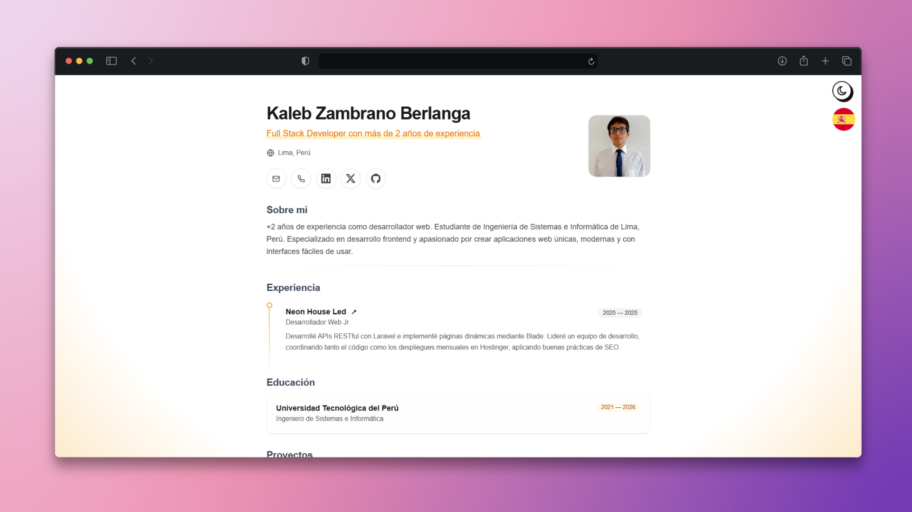

<div align="center">
  <h2>Portfolio JSON - Web Resume</h2>
A responsive web portfolio with support for multiple languages (ES, EN, FR, PT), dark mode and light mode.
<p>
CV JSON Schema from <a href="https://jsonresume.org/schema/">jsonresume.org</a>
</p>
<p>
Based on the design by <a href="https://github.com/midudev/minimalist-portfolio-json">Midudev</a>
</p>
</div>
</img>

## Description

This project is a fully customizable CV/Resume template powered by JSON files. It allows you to showcase your professional information in an elegant and modern way, featuring:

- **Multi-language support**: Spanish (default), English, French, and Portuguese
- **Dark/Light theme**: Automatic switching based on system preferences or manual toggle
- **Fully responsive**: Adapted for any device
- **Easy to customize**: Just edit the JSON files according to your language

## 🛠️ Stack

- [**Astro**](https://astro.build/): Fast and modern web framework.
- [**Typescript**](https://www.typescriptlang.org/): JavaScript with typed syntax.
- [**Tailwind CSS**](https://tailwindcss.com/): CSS utilities for flexible design.
- [**Tailwind Animations**](https://tailwind-animations.com/): Fast and spectacular animations.

## 🚀 Getting Started

### 1. Use this [repo](https://github.com/midudev/minimalist-portfolio-json) as a _template_ for an Astro project
```sh
# Initialize the project
npm create astro@latest -- --template KalZambrano/portfolio-json
```

### 2. Edit content

The default language is **Spanish** (`cv_es.json`). You can keep or remove the other available languages (EN, FR, and PT) based on your needs.

To manage languages, edit the `/config/languages.ts` file to add, remove, or modify the available language options.

Edit the JSON files according to the language you want to update:

- `cv_es.json` - For Spanish content
- `cv_en.json` - For English content
- `cv_fr.json` - For French content
- `cv_pt.json` - For Portuguese content

Each file contains sections such as: personal information, education, experience, projects, skills, etc.

### 3. Run in development

Once you've edited the files, start the development server:
```sh
# Check the result
npm run dev
```

The project will be available at `http://localhost:4321`

## 📦 Available Commands

All commands are run from the root of the project:

| Command              | Action                                        |
| :------------------- | :-------------------------------------------- |
| `npm install`        | Installs dependencies                         |
| `npm run dev`        | Starts local server at `localhost:4321`       |
| `npm run build`      | Build your production site to `./dist/`       |
| `npm run preview`    | Preview your build locally                    |

## 📁 Project Structure
```text
/
├── public/
├── src/
│   ├── assets/
│   │   ├── skills/
│   │   └── social/
│   ├── components/
│   │   ├── App.astro
│   │   ├── LanguageSelector.astro
│   │   └── sections/
│   ├── config/
│   │   └── languages.ts
│   ├── layouts/
│   │   └── Layout.astro
│   ├── pages/
│   │   ├── [lang]/
│   │   └── index.astro
│   ├── cv.d.ts
│   └── types.d.ts
├── cv_es.json
├── cv_en.json
├── cv_fr.json
├── cv_pt.json
└── package.json
```

## 🎨 Customization

- **Colors and styles**: Modify `src/styles/global.css` and `.astro` files
- **Languages**: Use `/config/languages.ts` to add or remove language options
- **Content**: Update the JSON files (`cv_*.json`) with your information

## 📄 License

Free to use and modify.
